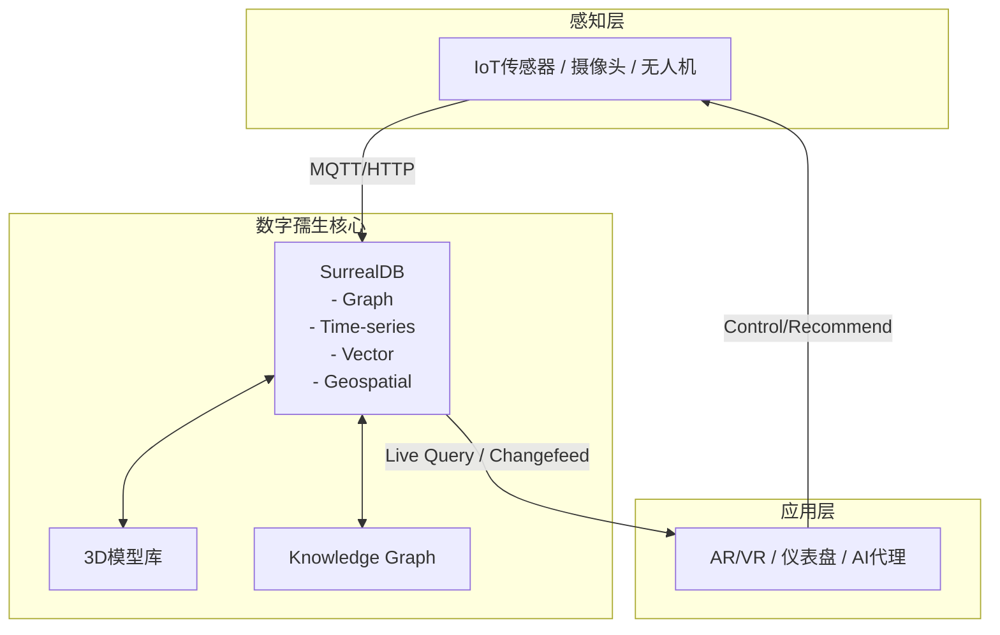

# 数字景区数字孺生层具体实现方案

## 1. 引言

数字孺生层是数字景区的核心大脑，负责将物理景区实时映射到虚拟空间，支持模拟、预测、优化和决策。结合SurrealDB多模型数据库、Rust微服务和AI代理，实现高性能、实时、可扩展的数字孺生平台。

## 2. 总体架构



## 3. 数据模型设计 (SurrealDB Schema)

```surql
-- 资产表
DEFINE TABLE asset TYPE NORMAL SCHEMAFULL;
DEFINE FIELD name ON TABLE asset TYPE string;
DEFINE FIELD type ON TABLE asset TYPE string; -- 景点 / 设备 / 游客
DEFINE FIELD location ON TABLE asset TYPE geometry; -- 地理空间
DEFINE FIELD status ON TABLE asset TYPE object; -- 实时状态

-- 关系表 (图谱)
DEFINE TABLE relation TYPE RELATION FROM asset TO asset;
DEFINE FIELD type ON TABLE relation TYPE string; -- contains / connects / monitors

-- 电信表 (时序列)
DEFINE TABLE telemetry TYPE NORMAL;
DEFINE FIELD asset_id ON TABLE telemetry TYPE record<asset>;
DEFINE FIELD timestamp ON TABLE telemetry TYPE datetime;
DEFINE FIELD value ON TABLE telemetry TYPE float;
DEFINE FIELD unit ON TABLE telemetry TYPE string;

-- 事件与知识图谱
DEFINE TABLE event TYPE NORMAL;
DEFINE TABLE document TYPE NORMAL; -- 文档、文化资料
```

## 4. 实现步骤

1. **数据采集** : Rust Edge Gateway 接入Modbus/MQTT/RTSP。
2. **实时同步** : SurrealDB changefeeds 或 live queries 到WebSocket前端。
3. **模型构建** : 倾斜摄影 + BIM 构建3D模型，ID关联SurrealDB。
4. **AI集成** : SurrealDB MCP 为AI代理提供上下文。
5. **可视化** : CesiumJS / Three.js 绑定数据库实体。

## 5. 与零碳和预测维护结合

- 能源监测数据进入telemetry表。
- AI代理基于图谱查询进行能源优化和故障预测。
- 支持算电协同优化。

**版本** : 1.0 | **日期** : 2026-06-07 | **作者** : 俞琳

(完整内容可进一步迭代和补充)