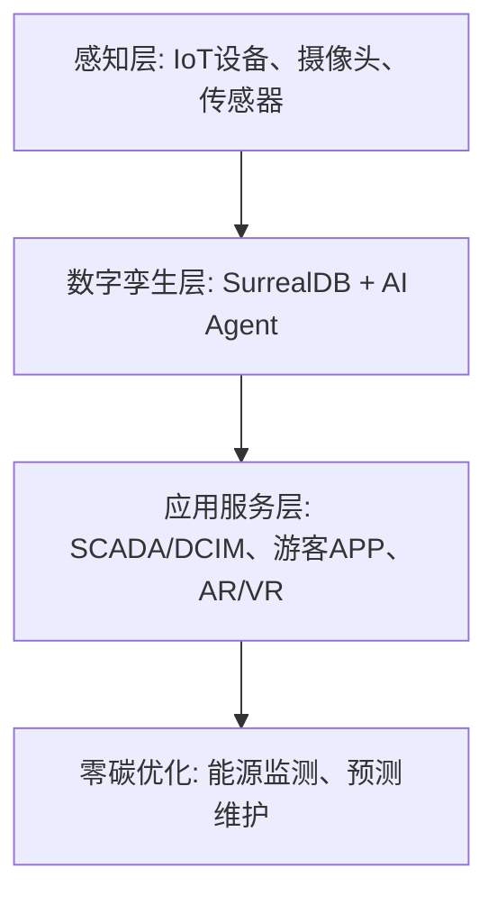

# 数字景区技术规范书

## 1. 引言

### 1.1 目的
本规范书旨在为数字景区建设提供技术指导框架，整合 IoT、AI、数字孪生等技术，实现景区智能化管理与游客智慧服务，支撑零碳景区目标。

### 1.2 适用范围
适用于新建或改造的智慧旅游景区，包括感知层、数字孪生层、应用服务层等。

## 2. 总体架构

## 3. 关键技术规范

- **基础设施**：5G/边缘计算、Rust微服务
- **AI集成**：YOLO-LLM 用于安防与客流分析
- **数据平台**：SurrealDB 多模型数据库
- **安全**：符合国家信息安全等级保护

## 4. 运维与验收

... (完整文档内容可后续迭代)

**版本**：1.0
**日期**：2026-06-07
**作者**：俞琳 (yulin724)